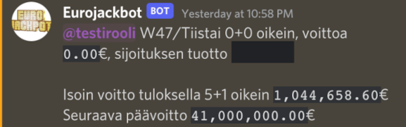

# Eurojackbot

Discord bot for getting the latest results of Eurojackpot and keeping track of your winnings/investment.




## Development requirements

 - Discord bot token
 - AWS Systems Manager Parameter Store parameter
 - AWS Credentials to read/write parameter at parameter strore
 - Python3

Create `env.json` file based on `env_example.json` file. Then
```
python3 -m venv venv
source venv/bin/activate
pip install -r requirements.txt
python main.py
```

## Deployment requirements
 - AWS CLI
 - AWS Lambda function with right settings (TODO: Write them down)
 - AWS Systems Manager Parameter Store parameter

Create `env_prod.json` file based on `env.json` file. Then
```
./deploy.sh
```